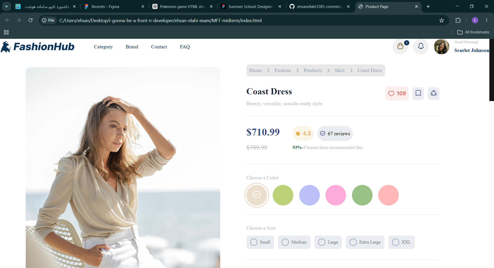

<h1 align="center">👗 Fashion Hub</h1>

<p align="center">
  
</p>

A modern and responsive fashion e-commerce landing page built using **HTML5** and **CSS3**. This project focuses on creating a clean, elegant, and user-friendly shopping interface with a fully responsive layout.

## 🚀 Live Demo

🔗 _Add your live demo link here_

---

## 📸 Preview

A stylish fashion shopping website featuring a modern UI, responsive design, and smooth user experience.

---

## ✨ Features

- 📱 Fully Responsive Design
- 🎨 Modern & Clean User Interface
- 🛍️ Fashion Product Showcase
- ⭐ Product Ratings
- 💲 Pricing Section
- ❤️ Wishlist Button
- 🖼️ Product Gallery
- 📦 Product Information
- 👗 Similar Products Section
- 📋 Customer Reviews Layout
- 📐 Pixel-Perfect Design

---

## 🛠️ Built With

- HTML5
- CSS3

---

## 📂 Project Structure

```text
fashion-hub/
│
├── assets/
│   ├── images/
│   ├── icons/
│   └── fonts/
│
├── index.html
├── style.css
└── README.md
```

---

## 📥 Installation

Clone the repository:

```bash
git clone https://github.com/your-username/fashion-hub.git
```

Open the project folder and run **index.html** in your browser.

---

## 🎯 Future Improvements

- JavaScript Interactivity
- Shopping Cart
- Product Search
- Dark Mode
- Image Gallery Slider
- Wishlist Functionality
- Responsive Animations

---

## 👨‍💻 Author

**Ehsan Elahi**

GitHub: https://github.com/ehsanellahi1385-commits

---

## ⭐ Support

If you like this project, don't forget to give it a ⭐ on GitHub!
